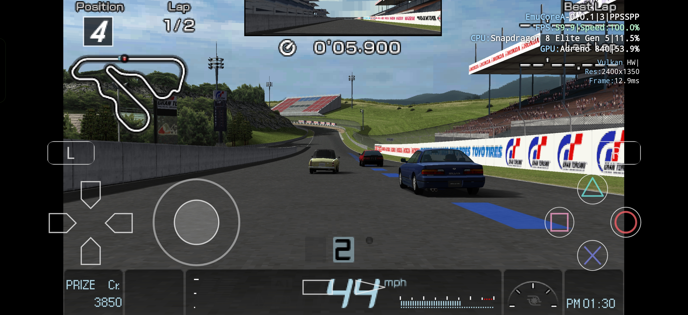
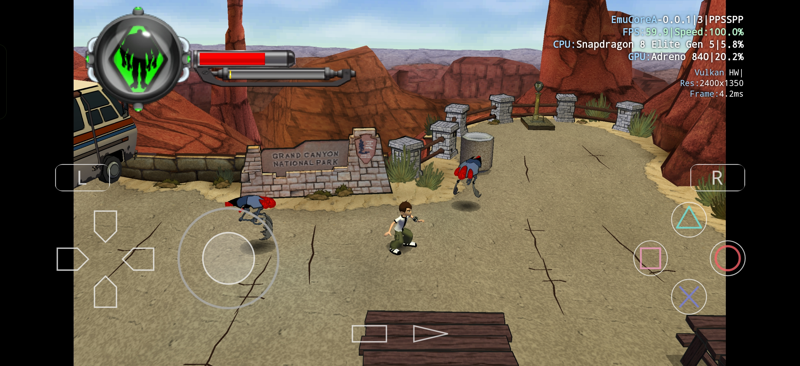
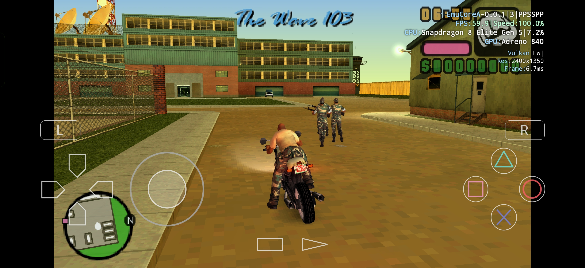
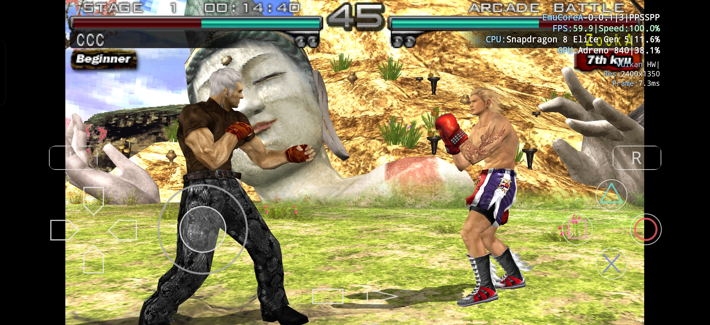
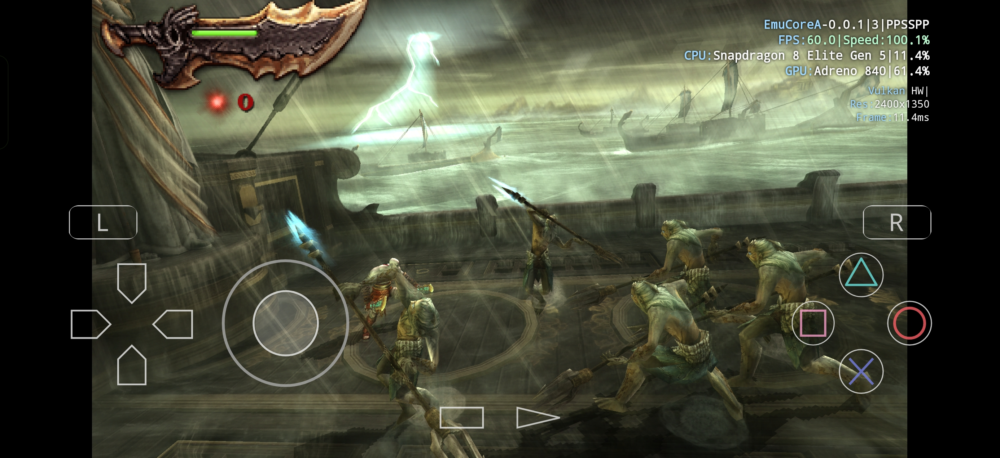

# EmuCoreA

[](https://www.patreon.com/c/emucore/membership)
[](https://discord.com/invite/c5EBeNRpz2)
[](https://emucorea.web.app/)

EmuCoreA is a PSP library, launcher, and emulator frontend for Android. It pairs a purpose-built Compose interface with a vendored [PPSSPP](https://github.com/hrydgard/ppsspp) core that is built together with the app, so no separate core download is needed.

Official website: [https://emucorea.web.app/](https://emucorea.web.app/)


The project is under active development. Use your own legally obtained games. PPSSPP emulates the PSP system without a BIOS file.

## Highlights

- PPSSPP-based emulation core built together with the app for ARM64 devices
- Vulkan, OpenGL ES, and software rendering with PSP internal resolution controls
- Game library with PSP title and ID extraction, cover art, search, and per-game settings
- Home screen with shelves, recently played titles, and quick resume
- In-game overlay with rendering, speed, and save state controls
- Touch controls with a layout editor, plus physical gamepad support
- Save states, PSP savedata management, and memory stick size settings
- Cheat and replacement texture catalogs for supported PSP games
- RetroAchievements and optional Discord integration
- Localized interface in 18 languages for phones, tablets, and Android TV

## Screenshots

In-game captures running on a Snapdragon 8 Elite Gen 5 device with the Vulkan renderer:

| Gran Turismo | Ben 10: Protector of Earth |
| --- | --- |
|  |  |

| GTA: Vice City Stories | Tekken: Dark Resurrection |
| --- | --- |
|  |  |

| God of War: Ghost of Sparta |
| --- |
|  |

## What This Repository Contains

This repository contains the Android application, its Kotlin UI, the JNI frontend, the vendored PPSSPP sources, and the Gradle module that builds the emulation core for Android. No games, save data, or account credentials are included.

## Tech Stack

- Kotlin + Jetpack Compose
- Android DataStore and Room
- JNI bridge to native C++ built with CMake and the Android NDK
- Vendored PPSSPP core built as a libretro library and driven by the app's own frontend
- Vulkan and OpenGL ES rendering paths with a shader chain runtime
- RetroAchievements integration through rcheevos
- Optional Discord Social SDK integration

## Current App Scope

EmuCoreA version `0.0.1` currently targets Android with:

- `minSdk 26` (Android 8.0)
- `targetSdk 37`
- package id `com.sbro.emucorea`
- version `0.0.1`
- ARM64 devices only

## Building Locally

### Requirements

- Android Studio with Android SDK and NDK configured
- JDK 17
- Android SDK 37 and Android NDK `29.0.14206865`
- CMake `3.30.5`

### Optional Google/Firebase configuration

Personal builds work without `app/google-services.json`. Without that file,
Firebase analytics, cloud profiles, cloud settings, and Google sign-in/Drive
backup are unavailable. Local emulation and local saves remain available.
To enable those services, provide a valid `app/google-services.json` for
`com.sbro.emucorea` with the required OAuth client configuration, then rebuild.
No placeholder credentials are generated.

### Debug Build

```powershell
.\gradlew :app:assembleDebug
```

### Release Build

```powershell
.\gradlew :app:assembleRelease
```

Install `app/build/outputs/apk/debug/app-debug.apk` on an ARM64 Android device.

### Optional Discord SDK

Discord support is built when a compatible Discord Social SDK directory is supplied through `emucorex.discord.sdkDir` in `local.properties`, a Gradle property with the same name, or `DISCORD_SDK_DIR`. The directory must contain `include/discordpp.h`, `arm64-v8a/libdiscord_partner_sdk.so`, and `discord_partner_sdk.aar`. The SDK is not included in this repository.

## Project Structure

- `app/` Android application, Kotlin UI, and JNI frontend sources
- `app/src/main/cpp` Native bridge and core integration
- `app/src/main/res` Android resources and translations
- `core/` Vendored PPSSPP sources
- `core-android/` Gradle module that builds the PPSSPP core for Android
- `tools/` Local release, catalog, and cover tooling (not part of the app build)

## Supported Content

ISO, CSO, and CHD are the main game image formats. PBP, ELF, and PRX support depends on the content and the bundled core. For ISO and PBP, the library can read the title, ID, and icon from PSP metadata. The bundled PSP catalog supplies additional cover art. No games, save data, or account credentials are included here.

## Content Catalogs

- [PSP cheats](https://github.com/sashkinbro/EmuCoreA-Cheat)
- [PSP texture packs](https://github.com/sashkinbro/EmuCoreA-Textures)

The catalogs credit the original sources. Redistributable files are mirrored in their respective catalog releases; entries without redistribution permission link to their authors' downloads.

## Notes

- Game images, save data, and account credentials are not distributed with this project.
- Compatibility, performance, and graphics behavior vary by game, device, renderer, and driver stack.
- Releases marked as "parallel" are identical to the primary build but use an alternate package ID, so they can be installed side by side.

## Credits and license

EmuCoreA builds on PPSSPP. The root [LICENSE.TXT](LICENSE.TXT) is an exact copy of PPSSPP's upstream license file. The vendored core and its dependencies retain their copyright and license notices in `core/`.

Thanks to the PPSSPP contributors and to the RetroAchievements team for rcheevos.

EmuCoreA is independent of Sony, PPSSPP, IGDB, Discord, and RetroAchievements. PSP is a trademark of Sony Interactive Entertainment. Game artwork and game data belong to their respective owners.

## Support

If you want to support ongoing development:

- Website: [https://emucorea.web.app/](https://emucorea.web.app/)
- Patreon: [https://www.patreon.com/c/emucore/membership](https://www.patreon.com/c/emucore/membership)
- Discord: [https://discord.com/invite/c5EBeNRpz2](https://discord.com/invite/c5EBeNRpz2)
- More apps by the author: [Google Play developer page](https://play.google.com/store/apps/dev?id=7136622298887775989)
